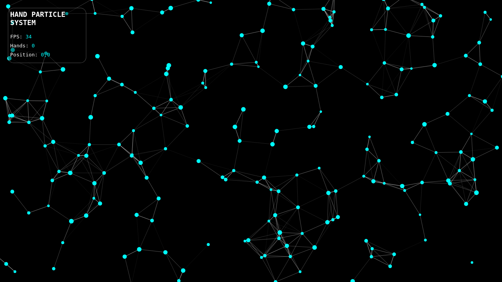
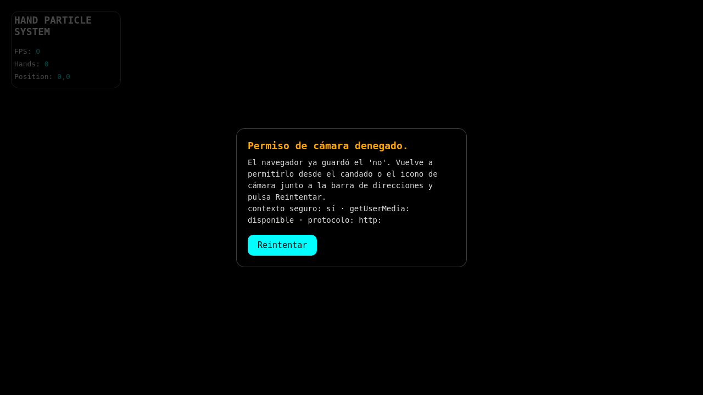

# Hand Particle System

Sistema de partículas en tiempo real controlado con las manos mediante la cámara. Las partículas se atraen hacia la mano, giran a su alrededor y reaccionan a los gestos.

**JavaScript · Vite · MediaPipe Tasks Vision · Canvas 2D**



*El sistema de partículas en funcionamiento. Captura realizada con la imagen de la cámara desactivada al fondo para que se aprecie el efecto.*

---

## Qué hace

- **Detecta hasta dos manos** en tiempo real con el modelo `hand_landmarker` de MediaPipe.
- **Reacción a la posición**: las partículas siguen a la muñeca de la mano.
- **Gesto de abrir y cerrar**:
  - **Puño cerrado** — las partículas son atraídas hacia la mano.
  - **Mano abierta** (3 o más dedos extendidos) — las partículas la repelen y describen una órbita a su alrededor, cambian a **naranja** y se produce una **explosión** radial en el momento de abrirla.
- **Enlaces de proximidad**: cada pareja de partículas a menos de 100 px se une con una línea cuya opacidad depende de la distancia.
- **Ilustración de la mano**: los 21 puntos de referencia landmarks en verde y la muñeca en rojo.
- **HUD** con FPS, número de manos y posición detectada.

## Características técnicas

- **Rejilla espacial** (`Int32Array`) para encontrar las parejas de partículas cercanas, en lugar de comparar todas entre sí. 6× menos CPU con resultados idénticos.
- **Bucle desacoplado**: las partículas se dibujan a la frecuencia de la pantalla aunque el detector de manos vaya más lento. La física usa paso fijo, así que la velocidad no cambia en pantallas de 60, 90 o 120 Hz.
- **Inferencia sólo cuando hay fotograma nuevo** mediante `requestVideoFrameCallback`, y a un ritmo ajustable.
- **Calidad adaptativa**: mide los FPS reales y ajusta resolución de render, densidad de partículas y frecuencia de inferencia. Si el delegado de GPU resulta lento, reconstruye el detector sobre CPU.
- **Diagnóstico de cámara**: detecta contexto no seguro, permission denegado, cámara ocupada o ausente, cámara revocada en caliente, y ofrece un botón **Reintentar**.
- **Adaptado a móvil**: `playsinline` para iOS, `dvh` para la barra de direcciones, `safe-area-inset` para el notch, `touch-action` para evitar el zoom accidental.
- **Carga en paralelo**: el modelo de 7,8 MB se descarga mientras el usuario decide sobre el permiso de cámara, con progreso real en pantalla.
- **Sin dependencias en tiempo de ejecución de terceros**: el WASM y el modelo se sirven desde el propio proyecto, con CDN como respaldo automático.

### Diagnóstico de errores de cámara

| Situación | Qué ocurre |
| --- | --- |
| Permiso denegado | Panel con el motivo y el botón Reintentar. Explica que hay que usar el candado o el icono de cámara de la barra de direcciones, porque el navegador ya guardó el «no». |
| Página en `http://` sin contexto seguro | Explica que hace falta `https://` o `localhost`, en vez de mostrar una pantalla negra. |
| Cámara ocupada por otra aplicación | Indica cerrarla y reintentar. |
| Sin cámara conectada | Mensaje específico. |
| Permiso revocado con la página abierta | Se detiene el bucle y se avisa. |
| Dispositivo que rechaza la resolución pedida | Reintenta con restricciones más simples. |



---

## Requisitos

- **Node.js** `^20.19.0` o `>=22.12.0`
- Un navegador con soporte de WebGL y `getUserMedia`: Chrome, Edge, Firefox o Safari actualizados
- **La cámara exige un contexto seguro**: `https://` o `http://localhost`. Al abrir el proyecto desde la IP local de tu red (por ejemplo `http://192.168.1.50:5173`) el navegador bloqueará la cámara.

## Instalación

```bash
npm install
```

El paso de instalación descarga automáticamente los assets de MediaPipe (WASM y modelo, unos 31 MB) a `public/mediapipe/`. Si esa carpeta no existe, la aplicación cae al CDN automáticamente.

Para descargarlos por separado:

```bash
npm run setup:assets
```

## Uso

```bash
npm run dev       # servidor de desarrollo
npm run build     # compila a dist/
npm run preview   # sirve dist/ para comprobar el resultado final
```

### Parámetros de depuración

Se pueden añadir a la URL durante el desarrollo:

| Parámetro | Efecto |
| --- | --- |
| `?delegate=cpu` | Fuerza el motor de inferencia por CPU y desactiva el cambio automático. |
| `?delegate=gpu` | Fuerza el motor por GPU. |

## Estructura del proyecto

```
index.html                     marcado, atributos para iOS, overlay de carga y error
vite.config.js                 configuración de Vite
scripts/fetch-assets.mjs       descarga de los assets de MediaPipe
docs/                          capturas del README

src/
├── main.js       orquestación, bucle de render, arranque y reintento
├── camera.js     permiso de cámara, escalera de restricciones, diagnóstico
├── tracker.js    descarga del modelo, creación del detector, lectura de la mano
├── particles.js  simulación física y rejilla espacial
├── renderer.js   dibujo en canvas 2D
├── quality.js    ajuste automático de calidad según los FPS
├── hud.js        escritura en el DOM sólo cuando el valor cambia
├── config.js     constantes: física, colores, presets de calidad
└── style.css     estilos y ajustes para móvil

public/mediapipe/               assets descargados por npm install (no versionados)
```

## Despliegue

`npm run build` genera un directorio `dist/` estático que se puede servir desde cualquier hosting.

Recuerda que **la cámara no funciona en `http://`**. En un despliegue público usa `https://` (GitHub Pages, Netlify, Vercel y Cloudflare Pages lo proporcionan por defecto).

El directorio `public/mediapipe/` contiene unos 31 MB y se incluye en el artefacto de compilación. Si tu hosting tiene límites de tamaño, considera servir esos archivos desde un CDN propio en lugar de incluirlos.

## Rendimiento

La versión original de este proyecto tardaba 50,0 ms por fotograma; la actual tarda 16,7 ms, medido en Chromium con el original reconstruido y ejecutado en las mismas condiciones.

| Fase | Original | Actual |
| --- | --- | --- |
| Inferencia de manos | 42–44 ms | 16–18 ms |
| Resto de JavaScript | 2,7–2,9 ms | 0,3 ms |
| Trabajo de navegador (rasterizado) | 3–5 ms | 0–1 ms |
| **Total por fotograma** | **50,0 ms** | **16,7 ms** |

El detalle completo del proceso de optimización —incluidas dos regresiones introducidas durante el propio trabajo que sólo se detectaron midiendo en un navegador real— está en **[INFORME-OPTIMIZACION.pdf](INFORME-OPTIMIZACION.pdf)**.

## Cómo funciona la rejilla espacial

Para dibujar los enlaces hay que saber qué partículas están a menos de 100 px. Compararlas todas entre sí cuesta 400 × 399 / 2 = **79.800 comprobaciones por fotograma**, y crece al cuadrado.

La rejilla divide el lienzo en celdas del tamaño exacto de esa distancia. Como dos partículas a menos de 100 px siempre están en celdas contiguas, basta mirar la celda propia y cuatro vecinas, lo que reduce el coste al orden de miles.

```js
// Listas enlazadas sobre Int32Array, sin asignaciones por fotograma.
// head[celda] = índice de la primera partícula de la celda (-1 si está vacía)
// next[i]     = índice de la siguiente partícula en la misma celda
next[i] = head[cell];
head[cell] = i;
```

Para no visitar dos veces el mismo par, de cada celda sólo se miran la vecina de la derecha y las tres de abajo: esas cuatro posiciones cubren las ocho direcciones repartiéndolas entre la partícula y su pareja.

## Créditos

- [MediaPipe Tasks Vision](https://ai.google.dev/edge/mediapipe) — detección de manos
- [Hand Landmarker model](https://storage.googleapis.com/mediapipe-models/hand_landmarker/hand_landmarker/float16/1/hand_landmarker.task) — modelo de detección
- [Vite](https://vite.dev) — servidor de desarrollo y empaquetado

## Licencia

Por añadir. Si publicas este repositorio, indica aquí la licencia que quieras usar (por ejemplo MIT, Apache-2.0 o GPL-3.0) y añade el fichero `LICENSE` correspondiente.
